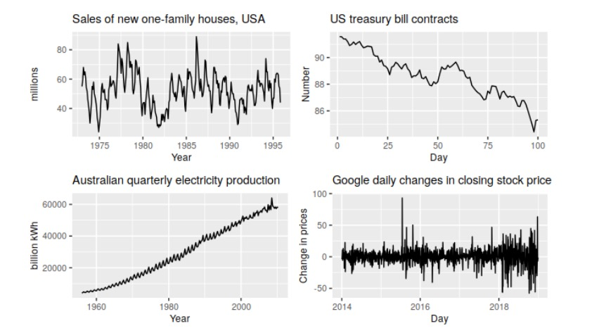

```{r setup, include=FALSE}
knitr::opts_chunk$set(
        echo = TRUE,
        comment = "#>",
        collapse = TRUE)
```

# Introduction

Chapter link: https://otexts.com/fpp3/graphics.html

The first thing to do in any data analysis task is to plot the data. Graphs enable many features of the data to be visualised, including patterns, unusual observations, changes over time, and relationships between variables. The features that are seen in plots of the data must then be incorporated, as much as possible, into the forecasting methods to be used. Just as the type of data determines what forecasting method to use, it also determines what graphs are appropriate. But before we produce graphs, we need to set up our time series in R.

# 2.1 `tsibble` objects

A time series can be thought of as a list of numbers (the measurements), along with some information about what times those numbers were recorded (the index). This information can be stored as a `tsibble` object in R.

```{r, message=FALSE}
library(tsibble)
library(tidyverse)

y <- tsibble(Year = 2015:2019, Observation = c(123,39,78,52,110), index = Year)
y
```

`tsibble` objects extend tidy data frames (`tibble` objects) by introducing temporal structure.

For observations that are more frequent than once per year, we need to use a time class function on the index. For example, suppose we have a monthly dataset `z`:

```{r}
z <- tibble(Month = c("2019 Jan", "2019 Feb", "2019 Mar", "2019 Apr"), Observation = c(50, 23, 34, 30))
z
```

This can be converted to a tsibble object using the `yearmonth()` function:

```{r}
z2  <- z %>% 
  mutate(Month = yearmonth(Month)) %>% 
  as_tsibble(index = Month)

z2
```

Other time class functions can be used depending on the frequency of the observations:

```{r}
z3  <- z %>% 
  mutate(Month = yearquarter(Month)) %>% 
  as_tsibble(index = Month)

z3
```

## Working with `tsibble` objects

```{r}
library(tsibbledata)
data(PBS)
PBS 
```

```{r}
PBS %>% 
  filter(ATC2 == "A10") %>% 
  select(Month, Concession, Type, Cost)

# PBS %>% 
#   filter(ATC2 == "A10") %>% 
#   select(Month, Cost)  # invalid as we get duplicate rows for each month (?)

```

```{r}
PBS %>%
  filter(ATC2=="A10") %>%
  select(Month, Concession, Type, Cost) %>%
  summarise(TotalC = sum(Cost))


```

```{r}
PBS %>%
  filter(ATC2=="A10") %>%
  select(Month, Concession, Type, Cost) %>%
  summarise(TotalC = sum(Cost)) %>%
  mutate(Cost = TotalC/1e6)
```

```{r}
PBS %>%
  filter(ATC2=="A10") %>%
  select(Month, Concession, Type, Cost) %>%
  summarise(TotalC = sum(Cost)) %>%
  mutate(Cost = TotalC/1e6) -> a10

a10
```

## Read a csv file and convert to a tsibble

```{r}

prison <- readr::read_csv("https://OTexts.com/fpp3/extrafiles/prison_population.csv")

prison <- prison %>%
  mutate(quarter = yearquarter(date)) %>%
  select(-date) %>%
  as_tsibble(key = c(state, gender, legal, indigenous), index = quarter)

prison

```

*For a tsibble to be valid, it requires a unique index for each combination of keys. The `tsibble()` or `as_tsibble()` function will return an error if this is not true.*

## The seasonal period

Some graphics and some models will use the seasonal period of the data. The seasonal period is the number of observations before the seasonal pattern repeats. In most cases, this will be automatically detected using the time index variable.

For quarterly, monthly and weekly data, there is only one seasonal period — the number of observations within each year. Actually, there are not  
52 weeks in a year, but 365.25/7= 52.18 on average, allowing for a leap year every fourth year. Approximating seasonal periods to integers can be useful as many seasonal terms in models only support integer seasonal periods.

If the data is observed more than once per week, then there is often more than one seasonal pattern in the data. For example, data with daily observations might have weekly (period = 7) or annual (period = 365.25) seasonal patterns. The same goes for data observed every minute (hourly, daily, weekly and annual seasonality).

More complicated (and unusual) seasonal patterns can be specified using the `period()` function in the lubridate package.

# 2.2 Time plots

For time series data, the obvious graph to start with is a time plot. That is, the observations are plotted against the time of observation, with consecutive observations joined by straight lines. Figure 2.1 below shows the weekly economy passenger load on Ansett Airlines between Australia’s two largest cities.

Let's start by inspecting the data:

```{r}
data(ansett)
tail(ansett)
glimpse(ansett)
summary(ansett)
```

Now we plot:

```{r}
library(feasts)  # NB need this or get error: the functions for graphics are in the feasts package. So just load the feasts package as well and you can autoplot() a tsibble object.

melsyd_economy <- ansett %>%
  filter(Airports == "MEL-SYD", Class=="Economy")

melsyd_economy %>%
  autoplot(Passengers) +
    labs(title = "Ansett economy class passengers", subtitle = "Melbourne-Sydney") +
    xlab("Year")
```

We will use the `autoplot()` command frequently. It automatically produces an appropriate plot of whatever you pass to it in the first argument. In this case, it recognises `melsyd_economy` as a time series and produces a time plot.

The time plot immediately reveals some interesting features.

* There was a period in 1989 when no passengers were carried — this was due to an industrial dispute.

* There was a period of reduced load in 1992. This was due to a trial in which some economy class seats were replaced by business class seats.

* A large increase in passenger load occurred in the second half of 1991.

* There are some large dips in load around the start of each year. These are due to holiday effects.

* There is a long-term fluctuation in the level of the series which increases during 1987, decreases in 1989, and increases again through 1990 and 1991.

* There are some periods of missing observations.

Any model will need to take all these features into account in order to effectively forecast the passenger load into the future.

A simpler time series is shown in Figure 2.2, using the a10 data saved earlier:

```{r}
a10 %>% autoplot(Cost) +
  ggtitle("Antidiabetic drug sales") +
  ylab("$ million") + xlab("Year")
```

Here, there is a clear and increasing trend. There is also a strong seasonal pattern that increases in size as the level of the series increases. The sudden drop at the start of each year is caused by a government subsidisation scheme that makes it cost-effective for patients to stockpile drugs at the end of the calendar year. Any forecasts of this series would need to capture the seasonal pattern, and the fact that the trend is changing slowly.

# 2.3 Time series patterns

In describing these time series, we have used words such as “trend” and “seasonal” which need to be defined more carefully.

*Trend*

* A trend exists when there is a long-term increase or decrease in the data. It does not have to be linear. Sometimes we will refer to a trend as “changing direction”, when it might go from an increasing trend to a decreasing trend. There is a trend in the antidiabetic drug sales data shown in Figure 2.2.

*Seasonal*

A seasonal pattern occurs when a time series is affected by seasonal factors such as the time of the year or the day of the week. Seasonality is always of a fixed and known period. The monthly sales of antidiabetic drugs (figure 2.2) shows seasonality which is induced partly by the change in the cost of the drugs at the end of the calendar year.

*Cyclic*

A cycle occurs when the data exhibit rises and falls that are not of a fixed frequency. These fluctuations are usually due to economic conditions, and are often related to the “business cycle”. The duration of these fluctuations is usually at least 2 years.

Many people confuse cyclic behaviour with seasonal behaviour, but they are really quite different. If the fluctuations are not of a fixed frequency then they are cyclic; if the frequency is unchanging and associated with some aspect of the calendar, then the pattern is seasonal. In general, the average length of cycles is longer than the length of a seasonal pattern, and the magnitudes of cycles tend to be more variable than the magnitudes of seasonal patterns.

Many time series include trend, cycles and seasonality. When choosing a forecasting method, we will first need to identify the time series patterns in the data, and then choose a method that is able to capture the patterns properly.

The examples in Figure 2.3 show different combinations of the above components:



1. The monthly housing sales (top left) show strong seasonality within each year, as well as some strong cyclic behaviour with a period of about 6–10 years. There is no apparent trend in the data over this period.

2. The US treasury bill contracts (top right) show results from the Chicago market for 100 consecutive trading days in 1981. Here there is no seasonality, but an obvious downward trend. Possibly, if we had a much longer series, we would see that this downward trend is actually part of a long cycle, but when viewed over only 100 days it appears to be a trend.

3. The Australian quarterly electricity production (bottom left) shows a strong increasing trend, with strong seasonality. There is no evidence of any cyclic behaviour here.

4. The daily change in the Google closing stock price (bottom right) has no trend, seasonality or cyclic behaviour. There are random fluctuations which do not appear to be very predictable, and no strong patterns that would help with developing a forecasting model.

# 2.4 Seasonal plots
